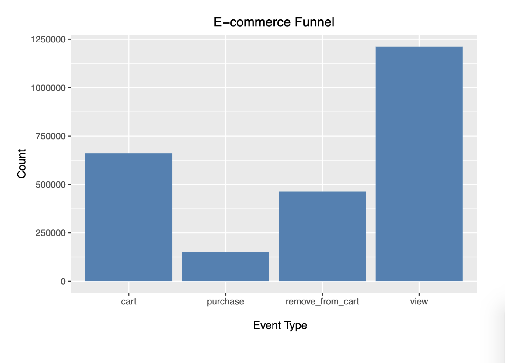
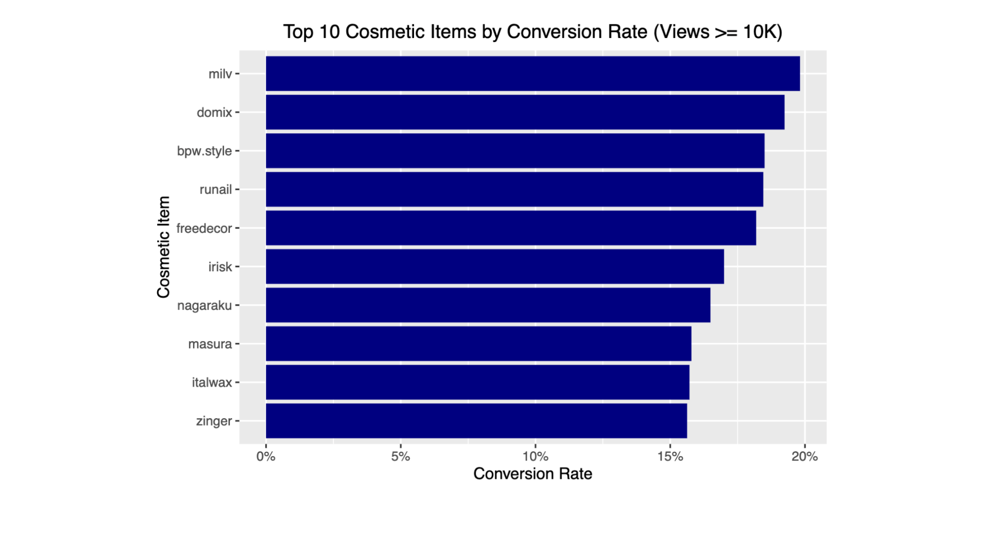
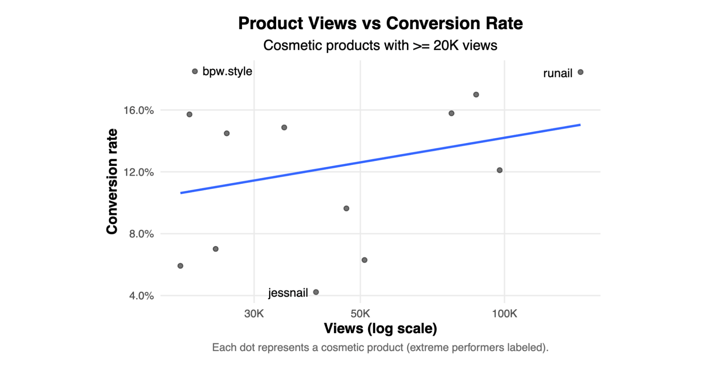

# E-commerce Funnel & Conversion Analysis

## Overview

This project analyzes **500,000+ e-commerce user interactions** from an online cosmetics dataset to examine customer behavior and evaluate differences in conversion performance across brands.

The analysis focuses on two main questions:

* How does customer activity differ across views, cart actions, and purchases?
* Does higher brand visibility correspond to higher conversion rates?

## Methods

Using **R and tidyverse**, I cleaned and aggregated behavioral event data including product views, cart additions, cart removals, and purchases.

The analysis included:

* Analyzing the distribution of customer activity across event types
* Calculating brand-level conversion rates
* Comparing conversion performance among high-traffic brands
* Visualizing the relationship between traffic volume and conversion rate
* Using linear regression to test whether higher view counts are associated with stronger conversion

To reduce misleading conversion estimates from low-traffic brands, some comparisons were restricted to brands exceeding minimum view thresholds.

## Results

### 1. Customer Activity Overview

Views were the most frequent event in the dataset, while purchase events occurred much less frequently than views and cart-related interactions.

### 2. Highest-Converting Brands

Among brands with at least **10,000 views**, conversion rates varied substantially. **Milv** had the highest conversion rate among the brands meeting the minimum traffic threshold.

### 3. Traffic vs. Conversion Rate

Higher traffic did not reliably correspond to stronger conversion performance.

A linear regression using log-transformed views produced:

* **R² = 0.0845**
* **p = 0.335**

View volume explained approximately **8.5% of the variation in conversion rates**, and the relationship was not statistically significant.

## Key Findings

* Higher brand visibility did not reliably translate into higher conversion
* Conversion performance varied substantially across high-traffic brands
* View volume explained only a small portion of the variation in conversion rates
* The relationship between traffic volume and conversion rate was not statistically significant
* Purchase events occurred much less frequently than views and cart-related interactions

## Technologies

**R** • **tidyverse** • **ggplot2** • **ggrepel** • **scales**

## Methods & Techniques

**Data Cleaning** • **Exploratory Data Analysis** • **Data Visualization** • **Conversion Rate Analysis** • **Linear Regression**

## Future Work

Future iterations of this project could include:

* Building a user- or session-level conversion funnel to track progression from view → cart → purchase
* Incorporating pricing and product-category information to investigate additional drivers of conversion
* Testing additional statistical models to better understand conversion performance
